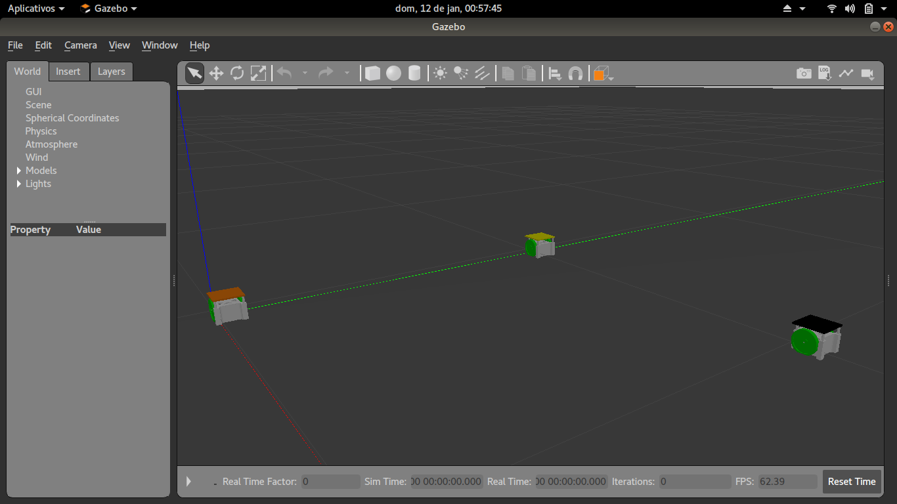

[](https://forthebadge.com)
[](https://forthebadge.com)

# Simulação de VSS em ROS com Gazebo

Projeto de simulação de um time VSS em um campo oficial em ROS utilizando Gazebo

É necessário clonar o projeto dentro de um workspace catkin. Para criar um workspace, veja [esse link](http://wiki.ros.org/catkin/Tutorials/create_a_workspace)

Para rodar a simulação com um robô controlável, digite:

```bash
roslaunch vss_simulation simulation_robot.launch
```

Para rodar a simulação com o time completo, digite:

```bash
roslaunch vss_simulation simulation_team.launch
```

## Dependencias

O projeto depende do pacote velocity_controllers dentro da biblioteca ros_controlles. É possível instalar com ```apt-get```

```bash
sudo apt install ros-melodic-velocity-controllers
```

Ou usando ```rosdep```

```bash
rosdep install vss_simulation
```

## TODO

No momento, a simulação possui os 3 robôs. Faltam incluir o campo e a bola.

## Screenshot



