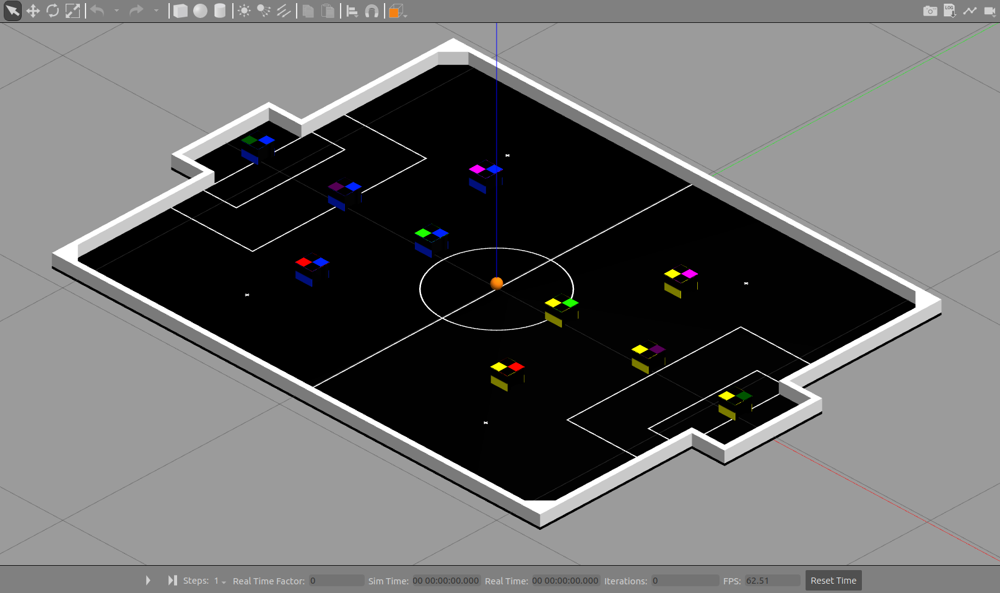

<h1 align="center">🥅 TraveSim</h1>
<p align="center">IEEE Very Small Size Soccer simulation project with ROS and Gazebo</p>

<p align="center">


<!-- ALL-CONTRIBUTORS-BADGE:START - Do not remove or modify this section -->

<!-- ALL-CONTRIBUTORS-BADGE:END -->
</p>

Para a versão em PT-BR 🇧🇷 desse documento, [veja aqui](./README.pt-br.md)

- [📷 Screenshots](#-screenshots)
- [🎈 Intro](#-intro)
- [🌎 Worlds](#-worlds)
- [📣 ROS topics](#-ros-topics)
  - [⬅ Input](#-input)
    - [Differential drive control (default)](#differential-drive-control-default)
    - [Direct motor control](#direct-motor-control)
  - [➡ Output](#-output)
- [📏 Used models](#-used-models)
  - [© Create your own model](#-create-your-own-model)
- [🔧 Parameters](#-parameters)
  - [🚀 Roslaunch](#-roslaunch)
- [📷 Virtual camera](#-virtual-camera)
- [📁 Folder structure](#-folder-structure)
- [➕ Dependencies](#-dependencies)
  - [🐍 Python virtual environment](#-python-virtual-environment)
- [🎨 Gazebo colors](#-gazebo-colors)
- [📝 Contributing](#-contributing)
- [✨ Contributors](#-contributors)

## 📷 Screenshots

<p align="center">
  
  
  
  
</p>

## 🎈 Intro

It is necessary to clone the project inside a catkin workspace. To create a workspace, refer to [this link](http://wiki.ros.org/catkin/Tutorials/create_a_workspace)

To run the simulation with one controllable robot

```bash
roslaunch travesim simulation_robot.launch
```

To run the simulation with the entire team

```bash
roslaunch travesim simulation_team.launch
```

To run the simulation of a match

```bash
roslaunch travesim simulation_match.launch
```

## 🌎 Worlds

TraveSim can handle simulating games with 3 or 5 robots per team. The number of robots per team will be inferred from the chosen simulation world. The worlds currently supported are as follows:

- `vss_field.world` - Base world for 3x3 matches
- `vss_field_camera.world` - World for 3x3 matches with camera and spotlights
- `vss_field_5.world` - Base world for 5x5 matches

So, for example, to run the simulation with a single team of 5 robots, run:

```bash
roslaunch travesim simulation_team.launch world_name:=vss_field_5.world
```

For more information about roslaunch parameters, see the [🚀 Roslaunch](#-roslaunch) section.

## 📣 ROS topics

### ⬅ Input

The simulation can work using 2 input interfaces, **differential drive control** (default) or **direct motor control**. It is important to notice that is not possible to use both interfaces to control different robots at the same time.

#### Differential drive control (default)

By default, the simulation receives commands of type [geometry_msgs/Twist](http://docs.ros.org/en/melodic/api/geometry_msgs/html/msg/Twist.html), representing the desired velocity of the robot in two components: linear and angular.

```python
# This expresses velocity in free space broken into its linear and angular parts.
Vector3  linear
Vector3  angular
```

The ROS topics follow the naming convention:

- **/yellow_team/robot_[0..2|0..4]/diff_drive_controller/cmd_vel**
- **/blue_team/robot_[0..2|0..4]/diff_drive_controller/cmd_vel**

The control of the robot is performed by the [diff_driver_controller](http://wiki.ros.org/diff_drive_controller) from the library [ros_control](http://wiki.ros.org/ros_control). The controller represents the behavior of the embedded system of the robot and will send torque commands to the motors in order to follow the received set point.

The parameters of this controller are specified in the file [./config/motor_diff_drive.yml](./config/motor_diff_drive.yml).

#### Direct motor control

The simulation also accepts control directly over **angular velocity** commands (in rad/s) for both robot's motors (through the interface [velocity_controller](http://wiki.ros.org/velocity_controllers) from [ros_control](http://wiki.ros.org/ros_control)). This interface mimics a controller interface more coupled to the robots characteristics than differential drive control.

The commands are read from topics of type [std_msgs/Float64](http://docs.ros.org/noetic/api/std_msgs/html/msg/Float64.html), representing each motor's speed in **rad/s**

- **/yellow_team/robot_[0..2|0..4]/left_controller/command**
- **/yellow_team/robot_[0..2|0..4]/right_controller/command**
- **/blue_team/robot_[0..2|0..4]/left_controller/command**
- **/blue_team/robot_[0..2|0..4]/right_controller/command**

In order to enable this control interface, one should send the parameter `twist_interface` as false in roslaunch [parameters](#-parameters)

The parameters of this controller are specified in the file [./config/motor_direct_drive.yml](./config/motor_direct_drive.yml).

### ➡ Output

By default, Gazebo publishes in the topic **/gazebo/model_states** of type [gazebo_msgs/ModelStates](http://docs.ros.org/melodic/api/gazebo_msgs/html/msg/ModelStates.html), with an array of informations about each model in the simulation.

```python
# broadcast all model states in world frame
string[] name                 # model names
geometry_msgs/Pose[] pose     # desired pose in world frame
geometry_msgs/Twist[] twist   # desired twist in world frame
```

For convenience, this package have a script ([vision_proxy.py](./scripts/vision_proxy.py)) that subscribes this topic and republishes the information at different topics of type [gazebo_msgs/ModelState](http://docs.ros.org/melodic/api/gazebo_msgs/html/msg/ModelState.html) for each entity (3 yellow team robots, 3 blue team robots and 1 ball, 7 in total).

```python
# Set Gazebo Model pose and twist
string model_name           # model to set state (pose and twist)
geometry_msgs/Pose pose     # desired pose in reference frame
geometry_msgs/Twist twist   # desired twist in reference frame
string reference_frame      # set pose/twist relative to the frame of this entity (Body/Model)
                            # leave empty or "world" or "map" defaults to world-frame
```

The republished topics are

- **/vision/yellow_team/robot_[0..2|0..4]** - Yellow team robots's topics
- **/vision/blue_team/robot_[0..2|0..4]** - Blue team robots's topics
- **/vision/ball** - Ball's topic

All units are [SI](https://en.wikipedia.org/wiki/International_System_of_Units), distances are measured in meters, angles in radians, linear velocity in m/s and angular velocity in rad/s.

## 📏 Used models

The simulation is build upon a generic vss robot (more details [here](./urdf/motor.xacro)), inspired by [VSS SDK model](https://github.com/VSS-SDK/VSS-SDK).

As support, models were created for the VSS field and ball, both build from [Robocore's rules](https://www.robocore.net/modules.php?name=Forums&file=download&id=1424) for IEEE VSS.

### © Create your own model

To create a model for your project, refer to:

- [Phobos](https://github.com/dfki-ric/phobos) - Generate urdf files from Blender
- [SW2URDF](http://wiki.ros.org/sw_urdf_exporter) - Generate urdf files from SolidWorks
- [fusion2urdf](https://github.com/syuntoku14/fusion2urdf) - Generate urdf files from Fusion 360
- [ROS wiki](http://wiki.ros.org/urdf/Tutorials/Building%20a%20Visual%20Robot%20Model%20with%20URDF%20from%20Scratch) - How build a urdf model from scratch

To use your custom model, change the value of the ```model``` parameter when launching the simulation.

## 🔧 Parameters

### 🚀 Roslaunch

- ```world_name``` - Name of world file inside `./worlds` folder, default "vss_field.world"
- ```model``` - Path of simulated robot model, default "./urdf/vss_robot.xacro"
- ```controller_config_file``` - Path of simulated robot controllers config file, default "./config/motor_diff_drive.yml" if `twist_interface` is true, "./config/motor_direct_drive.yml" otherwise
- ```ros_control_config_file``` - Path of `gazebo_ros_control` config file, default "./config/ros_control_config.yml"
- ```debug``` - Enable debug messages in terminal, default "false"
- ```gui``` - Enable Gazebo's GUI window, default "true"
- ```paused``` - Init simulation paused, default "true"
- ```use_sim_time``` - Use simulated time as reference in messages, default "true"
- ```recording``` - Enable Gazebo's state log, default "false"
- ```keyboard``` - Enable joystick/keyboard control node, default "false"
- ```twist_interface``` - Enable [geometry_msgs/Twist](http://docs.ros.org/en/melodic/api/geometry_msgs/html/msg/Twist.html) interface if true, 2 std_msgs/Float64 control interface otherwise. Default "true". See the [docs](#-intro) for more info.

To pass a parameter to the simulation, just write the parameter name and its new value with `:=`

For example, to change the parameter `keyboard` to `true`:

```bash
roslaunch travesim simulation_team.launch keyboard:=true
```

## 📷 Virtual camera

The simulation has a virtual camera that record images from the top of the field, in the same way as a real VSS match. To enable it, one should use the world file `vss_field_camera.world`

```sh
roslaunch travesim simulation_team.launch world_name:=vss_field_camera.world
```

The images are published in the topic **/camera/image_raw**

It is possible to watch the footage with the package [image_view](http://wiki.ros.org/image_view)

```sh
rosrun image_view image_view image:=/camera/image_raw
```

## 📁 Folder structure

- **bagfiles/** - Folder to store recorded [bagfiles](./bagfiles/README.md)
- **docs/** - Documentation files
- **launch/** - [Roslaunch](http://wiki.ros.org/roslaunch) files written in ROS [XML syntax](http://wiki.ros.org/roslaunch/XML)
- **meshes/** - .stl files for [vss_generic_robot](./urdf/README.md), created with SolidWorks [SW2URDF](http://wiki.ros.org/sw_urdf_exporter) extension
- **models/** - [Custom Gazebo models](http://gazebosim.org/tutorials?tut=build_model) used inside the simulation, as the field and the VSS ball
- **scripts/** - Python scripts used in the project
  - keyboard_node.py - Pygame script to capture keyboard or joystick input to control the simulation
  - vision_proxy.py - Script to split [gazebo_msgs/ModelStates](http://docs.ros.org/melodic/api/gazebo_msgs/html/msg/ModelStates.html) array in several [gazebo_msgs/ModelState](http://docs.ros.org/melodic/api/gazebo_msgs/html/msg/ModelState.html) topics

- **urdf/** - Robot description files in [.urdf](http://wiki.ros.org/urdf/XML) and [.xacro](http://wiki.ros.org/xacro) format. The .urdf files were generated with SolidWorks [SW2URDF](http://wiki.ros.org/sw_urdf_exporter) extension
- **worlds/** - World files in [SDL](http://sdformat.org/) format

## ➕ Dependencies

The simulation is develop for ROS and Gazebo, it is recommend to install both with:

```bash
sudo apt install ros-noetic-desktop-full
```

The project depends on the package velocity_controllers and effort_controllers in the library [ros_controllers](https://github.com/ros-controls/ros_controllers) and the python library [pygame](https://github.com/pygame/pygame). It is possible to install both with ```apt-get```

```bash
sudo apt install ros-noetic-velocity-controllers ros-noetic-effort-controllers python3-pygame
```

Or using ```rosdep```

```bash
rosdep install travesim
```

### 🐍 Python virtual environment

One may want to run the project inside a python [virtualenv](https://docs.python.org/3/tutorial/venv.html), after all this is a good practice in the python development book

You can create a python environment with the command

```sh
python3 -m venv venv
```

Then you should run ```source``` in the virtual environment

```sh
source ./venv/bin/activate
```

To install the dependencies, run the command

```sh
pip install -r requirements.txt
```

Some external libraries may be missing to [build](https://stackoverflow.com/questions/7652385/where-can-i-find-and-install-the-dependencies-for-pygame) ```pygame``` package. You can install then with

```sh
sudo apt-get install
  subversion \
  ffmpeg \
  libsdl1.2-dev \
  libsdl-image1.2-dev \
  libsdl-mixer1.2-dev \
  libsdl-ttf2.0-dev \
  libavcodec-dev \
  libavformat-dev \
  libportmidi-dev \
  libsmpeg-dev \
  libswscale-dev \
```

## 🎨 Gazebo colors

For a list of default available color in Gazebo, refer to the config file in the [oficial repo](https://github.com/osrf/gazebo/blob/gazebo11/media/materials/scripts/gazebo.material). We have also 2 OGRE scripts [team blue](./media/materials/scripts/team_blue.material) and [team yellow](./media/materials/scripts/team_yellow.material) for custom colors definition ([Gazebo ref](http://gazebosim.org/tutorials?tut=color_model) and [OGRE ref](http://wiki.ogre3d.org/Materials))

## 📝 Contributing

Any help in the development of robotics is welcome, we encourage you to contribute to the project! To learn how, see the contribution guidelines [here](CONTRIBUTING.md).

## ✨ Contributors

Thanks goes to these wonderful people ([emoji key](https://allcontributors.org/docs/en/emoji-key)):

<!-- ALL-CONTRIBUTORS-LIST:START - Do not remove or modify this section -->
<!-- prettier-ignore-start -->
<!-- markdownlint-disable -->
<table>
  <tr>
    <td align="center"><a href="https://github.com/FelipeGdM"><br /><sub><b>Felipe Gomes de Melo</b></sub></a><br /><a href="https://github.com/thunderatz/travesim/commits?author=FelipeGdM" title="Documentation">📖</a> <a href="https://github.com/thunderatz/travesim/pulls?q=is%3Apr+reviewed-by%3AFelipeGdM" title="Reviewed Pull Requests">👀</a> <a href="https://github.com/thunderatz/travesim/commits?author=FelipeGdM" title="Code">💻</a> <a href="#translation-FelipeGdM" title="Translation">🌍</a></td>
    <td align="center"><a href="https://github.com/LucasHaug"><br /><sub><b>Lucas Haug</b></sub></a><br /><a href="https://github.com/thunderatz/travesim/pulls?q=is%3Apr+reviewed-by%3ALucasHaug" title="Reviewed Pull Requests">👀</a> <a href="https://github.com/thunderatz/travesim/commits?author=LucasHaug" title="Code">💻</a> <a href="#translation-LucasHaug" title="Translation">🌍</a> <a href="https://github.com/thunderatz/travesim/commits?author=LucasHaug" title="Documentation">📖</a></td>
    <td align="center"><a href="https://github.com/Tocoquinho"><br /><sub><b>tocoquinho</b></sub></a><br /><a href="#ideas-Tocoquinho" title="Ideas, Planning, & Feedback">🤔</a> <a href="https://github.com/thunderatz/travesim/commits?author=Tocoquinho" title="Documentation">📖</a></td>
    <td align="center"><a href="https://github.com/Berbardo"><br /><sub><b>Bernardo Coutinho</b></sub></a><br /><a href="https://github.com/thunderatz/travesim/pulls?q=is%3Apr+reviewed-by%3ABerbardo" title="Reviewed Pull Requests">👀</a> <a href="https://github.com/thunderatz/travesim/commits?author=Berbardo" title="Code">💻</a> <a href="https://github.com/thunderatz/travesim/commits?author=Berbardo" title="Documentation">📖</a></td>
    <td align="center"><a href="https://github.com/lucastrschneider"><br /><sub><b>Lucas Schneider</b></sub></a><br /><a href="https://github.com/thunderatz/travesim/pulls?q=is%3Apr+reviewed-by%3Alucastrschneider" title="Reviewed Pull Requests">👀</a> <a href="https://github.com/thunderatz/travesim/commits?author=lucastrschneider" title="Code">💻</a> <a href="#translation-lucastrschneider" title="Translation">🌍</a> <a href="https://github.com/thunderatz/travesim/commits?author=lucastrschneider" title="Documentation">📖</a></td>
    <td align="center"><a href="https://github.com/JuliaMdA"><br /><sub><b>Júlia Mello</b></sub></a><br /><a href="#design-JuliaMdA" title="Design">🎨</a> <a href="#data-JuliaMdA" title="Data">🔣</a></td>
    <td align="center"><a href="https://github.com/ThallesCarneiro"><br /><sub><b>ThallesCarneiro</b></sub></a><br /><a href="#design-ThallesCarneiro" title="Design">🎨</a> <a href="#data-ThallesCarneiro" title="Data">🔣</a></td>
  </tr>
  <tr>
    <td align="center"><a href="https://github.com/TetsuoTakahashi"><br /><sub><b>TetsuoTakahashi</b></sub></a><br /><a href="#ideas-TetsuoTakahashi" title="Ideas, Planning, & Feedback">🤔</a></td>
    <td align="center"><a href="https://github.com/GabrielCosme"><br /><sub><b>Gabriel Cosme Barbosa</b></sub></a><br /><a href="https://github.com/thunderatz/travesim/pulls?q=is%3Apr+reviewed-by%3AGabrielCosme" title="Reviewed Pull Requests">👀</a></td>
    <td align="center"><a href="https://github.com/RicardoHonda"><br /><sub><b>RicardoHonda</b></sub></a><br /><a href="https://github.com/thunderatz/travesim/pulls?q=is%3Apr+reviewed-by%3ARicardoHonda" title="Reviewed Pull Requests">👀</a></td>
    <td align="center"><a href="https://github.com/leticiakimoto"><br /><sub><b>leticiakimoto</b></sub></a><br /><a href="https://github.com/thunderatz/travesim/pulls?q=is%3Apr+reviewed-by%3Aleticiakimoto" title="Reviewed Pull Requests">👀</a></td>
  </tr>
</table>

<!-- markdownlint-restore -->
<!-- prettier-ignore-end -->

<!-- ALL-CONTRIBUTORS-LIST:END -->

This project follows the [all-contributors](https://github.com/all-contributors/all-contributors) specification. Contributions of any kind welcome!
