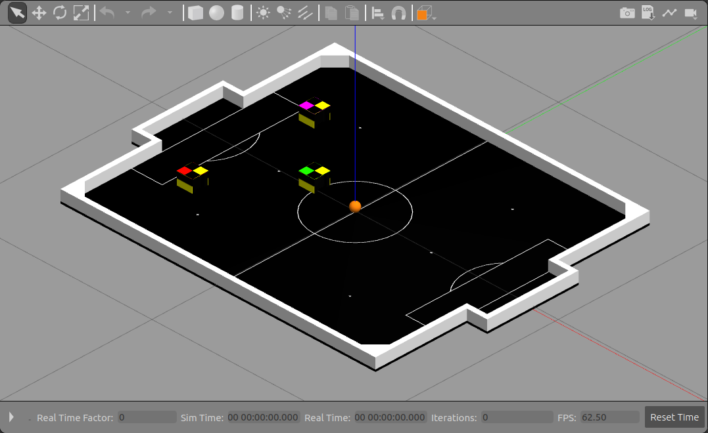

[](https://forthebadge.com)
[](https://forthebadge.com)

# Simulação de VSS em ROS com Gazebo

Projeto de simulação de um time IEEE VSS em um campo oficial em ROS utilizando Gazebo

- [Simulação de VSS em ROS com Gazebo](#simula%c3%a7%c3%a3o-de-vss-em-ros-com-gazebo)
  - [Introdução](#introdu%c3%a7%c3%a3o)
  - [Estrutura de pastas](#estrutura-de-pastas)
  - [Dependências](#depend%c3%aancias)
  - [Modelos utilizados](#modelos-utilizados)
  - [TODO](#todo)
  - [Screenshots](#screenshots)
    - [Simulação de um robô](#simula%c3%a7%c3%a3o-de-um-rob%c3%b4)
    - [Simulação do time](#simula%c3%a7%c3%a3o-do-time)
  - [Custom models](#custom-models)

## Introdução

É necessário clonar o projeto dentro de um workspace catkin. Para criar um workspace, veja [esse link](http://wiki.ros.org/catkin/Tutorials/create_a_workspace)

Para rodar a simulação com um robô controlável, digite:

```bash
roslaunch vss_simulation simulation_robot.launch
```

Para rodar a simulação com o time completo, digite:

```bash
roslaunch vss_simulation simulation_team.launch
```

## Estrutura de pastas

TODO

- **docs/**
- **launch/**
- **meshes/**
- **models/**
- **scripts/**
- **urdf/**
- **worlds/**

## Dependências

O projeto depende do pacote velocity_controllers dentro da biblioteca ros_controlles. É possível instalar com ```apt-get```

```bash
sudo apt install ros-melodic-velocity-controllers
```

Ou usando ```rosdep```

```bash
rosdep install vss_simulation
```

## Modelos utilizados

A simulação é construída em volta da versão 1.1 do robô de VSS do time ThunderVolt. Como suporte, foram criados modelos para o campo do VSS e para a bola de golf utilizada na partida, ambos construídos a partir das [regras da Robocore](https://www.robocore.net/modules.php?name=Forums&file=download&id=1424) para IEEE VSS.

## TODO

Completar documentação e integrar com código do [ThunderVolt](https://github.com/ThundeRatz/vss_thundervolt).

## Screenshots

### Simulação de um robô


### Simulação do time



## Custom models

http://gazebosim.org/tutorials?tut=build_model#ComponentsofaSDFModels
http://gazebosim.org/tutorials?tut=build_world
http://gazebosim.org/tutorials?tut=drcsim_create_atlas_world&cat=drcsim
http://wiki.ros.org/cob_gazebo_worlds/Tutorials/Create%20your%20own%20world
https://answers.ros.org/question/53752/how-can-i-transform-an-urdf-file-to-an-sdf-file/