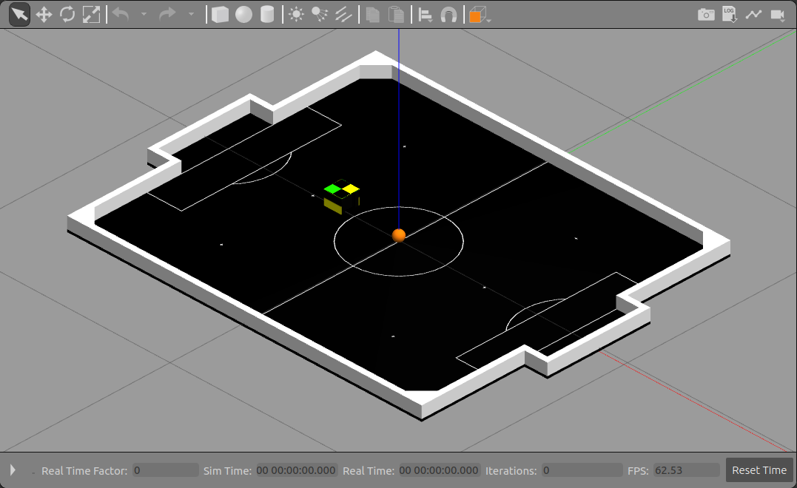

[](https://forthebadge.com)
[](https://forthebadge.com)

# VSS simulation with ROS and Gazebo

IEEE VSS team simulation project with ROS and Gazebo

Para a versão em PT-BR 🇧🇷 desse documento, [veja aqui](./README_ptbr.md)

- [VSS simulation with ROS and Gazebo](#vss-simulation-with-ros-and-gazebo)
  - [📷 Screenshots](#-screenshots)
    - [One robot simulation](#one-robot-simulation)
    - [Team simulation](#team-simulation)
    - [Match simulation](#match-simulation)
  - [🎈 Intro](#-intro)
  - [📣 ROS topics](#-ros-topics)
    - [⬅ Input](#-input)
    - [➡ Output](#-output)
  - [🔧 Parameters](#-parameters)
    - [Roslaunch](#roslaunch)
  - [📁 Folder structure](#-folder-structure)
  - [➕ Dependencies](#-dependencies)
  - [📏 Used models](#-used-models)
  - [🎨 Gazebo colors](#-gazebo-colors)

## 📷 Screenshots

### One robot simulation



### Team simulation


### Match simulation


## 🎈 Intro

It is necessary to cone the project inside a catkin workspace. To create a workspace, refer to [this link](http://wiki.ros.org/catkin/Tutorials/create_a_workspace)

To run the simulation with one controlable robot

```bash
roslaunch vss_simulation simulation_robot.launch
```

To run the simulation with the entire team

```bash
roslaunch vss_simulation simulation_team.launch
```

To run the simulation of a match

```bash
roslaunch vss_simulation simulation_match.launch
```

## 📣 ROS topics

### ⬅ Input

The simulation accepts control over **torque** comands (through the interface **effort_controller**) or over **angular velocity** commands (through the interface **velocity_controller**) for the two motors of each robot. Both interfaces are available in the library [ros_control](http://wiki.ros.org/ros_control)

To simulate robots without closed loop rotation simulation, the control over **torque** is more suitable, since torque is approximately proportional to applied tension in a DC motor terminals

In the other hand, the control interface over **angular velocity** is more suitable

In both cases, the comands are read from topics of type [std_msgs/Float64](http://docs.ros.org/melodic/api/std_msgs/html/msg/Float64.html)

- **/robot[1..3]/vss_robot_left_controller/command**
- **/robot[1..3]/vss_robot_right_controller/command**
- **/foe[1..3]/vss_robot_left_controller/command**
- **/foe[1..3]/vss_robot_right_controller/command**

### ➡ Output

By default, Gazebo publishes in the topic **/gazebo/model_states** of type [gazebo_msgs/ModelStates](http://docs.ros.org/melodic/api/gazebo_msgs/html/msg/ModelStates.html), with an array of informations about each model in the simulation.

```c
# broadcast all model states in world frame
string[] name                 # model names
geometry_msgs/Pose[] pose     # desired pose in world frame
geometry_msgs/Twist[] twist   # desired twist in world frame
```

For convenience, this package have a script ([vision_proxy.py](./scripts/vision_proxy.py)) that subscribes this topic and republishes the information at diferent topics of type [gazebo_msgs/ModelState](http://docs.ros.org/melodic/api/gazebo_msgs/html/msg/ModelState.html) for each entity (3 robots, 3 foes and 1 ball, 7 in total)

```c
# Set Gazebo Model pose and twist
string model_name           # model to set state (pose and twist)
geometry_msgs/Pose pose     # desired pose in reference frame
geometry_msgs/Twist twist   # desired twist in reference frame
string reference_frame      # set pose/twist relative to the frame of this entity (Body/Model)
                            # leave empty or "world" or "map" defaults to world-frame
```

The republised topics are

- **/vision/robot[1...3]** - Tópicos para os robôs do nosso time
- **/vision/foe[1...3]** - Tópicos para os robôs adversários
- **/vision/ball** - Tópico para a bola

All units are [SI](https://en.wikipedia.org/wiki/International_System_of_Units), distances are measured in meters, angles in radians, linear velocity in m/s and angular velocity in rad/s

## 🔧 Parameters

### Roslaunch

- ```model``` - Path of simulated robot model, default "./urdf/vss_robot.xacro"
- ```debug``` - Enable debug messagens in termianl, default "false"
- ```gui``` - Enable Gazebo's GUI window, default "true"
- ```paused``` - Init simulation paused, default "true"
- ```use_sim_time``` - Use simulated time as reference in messages, default "true"
- ```recording``` - Enable Gazebo's state log, default "false"
- ```keyboard``` - Enable joystick/keyboard control node, default "false"

To change a simulation parameter, just type the parameter followed by ```:=``` and the new value

For example, to change the parameter ```keyboard``` to ```true```:

```bash
roslaunch vss_simulation simulation_team.launch keyboard:=true
```

## 📁 Folder structure

- **docs/** - Documentation files
- **launch/** - [Roslaunch](http://wiki.ros.org/roslaunch) files written in [XML syntax](http://wiki.ros.org/roslaunch/XML) do ROS
- **meshes/** - .stl files for [vss_generic_robot](./urdf/README.md), created with SolidWorks extension [SW2URDF](http://wiki.ros.org/sw_urdf_exporter) do SolidWorks
- **models/** - [Custom Gazebo models](http://gazebosim.org/tutorials?tut=build_model) used inside the simulation, as the field and the VSS ball
- **scripts/** - Python scripts used in the project
  - keyboard_node.py - Pygame script to capture keyboard or joystick input to control the simulation
  - velocity_proxy.py - Script to convert a [std_msgs/Twist](http://docs.ros.org/melodic/api/geometry_msgs/html/msg/Twist.html) message from a [rqt robot steering](http://wiki.ros.org/rqt_robot_steering) to speed or torque comands to 2 motors
  - vision_proxy.py - Script to split [gazebo_msgs/ModelStates](http://docs.ros.org/melodic/api/gazebo_msgs/html/msg/ModelStates.html) array in several [gazebo_msgs/ModelState](http://docs.ros.org/melodic/api/gazebo_msgs/html/msg/ModelState.html) topics

- **urdf/** - Robot description files in [.urdf](http://wiki.ros.org/urdf/XML) and [.xacro](http://wiki.ros.org/xacro) format. The .urdf files were generated with SolidWorks [SW2URDF](http://wiki.ros.org/sw_urdf_exporter) extension
- **worlds/** - World files in [SDL](http://sdformat.org/) format

## ➕ Dependencies

The simulation is develop for ROS and Gazebo, it is recommend to install both with:

```bash
sudo apt install ros-melodic-desktop-full
```

The project depends on the package velocity_controllers and effort_controllers in the library [ros_controllers](https://github.com/ros-controls/ros_controllers) and the python lybrary [pygame](https://github.com/pygame/pygame). It is possible to install both with ```apt-get```

```bash
sudo apt install ros-melodic-velocity-controllers ros-melodic-effort-controllers python-pygame
```

Or using ```rosdep```

```bash
rosdep install vss_simulation
```

## 📏 Used models

The simulation is build upon a generic vss robot, inspired by [VSS SDK model](https://github.com/VSS-SDK/VSS-SDK)

As support, were created models for the VSS field and ball, both build from [Robocore's rules](https://www.robocore.net/modules.php?name=Forums&file=download&id=1424) for IEEE VSS

## 🎨 Gazebo colors

For a list of default available color in Gazebo, refert to the config file in the [oficial repo](https://bitbucket.org/osrf/gazebo/src/gazebo11/media/materials/scripts/gazebo.material). We have also 2 OGRE scripts [team blue](./media/materials/scripts/team_blue.material) and [team yellow](./media/materials/scripts/team_yellow.material) for custom colors definition ([Gazebo ref](http://gazebosim.org/tutorials?tut=color_model) and [OGRE ref](http://wiki.ogre3d.org/Materials))
