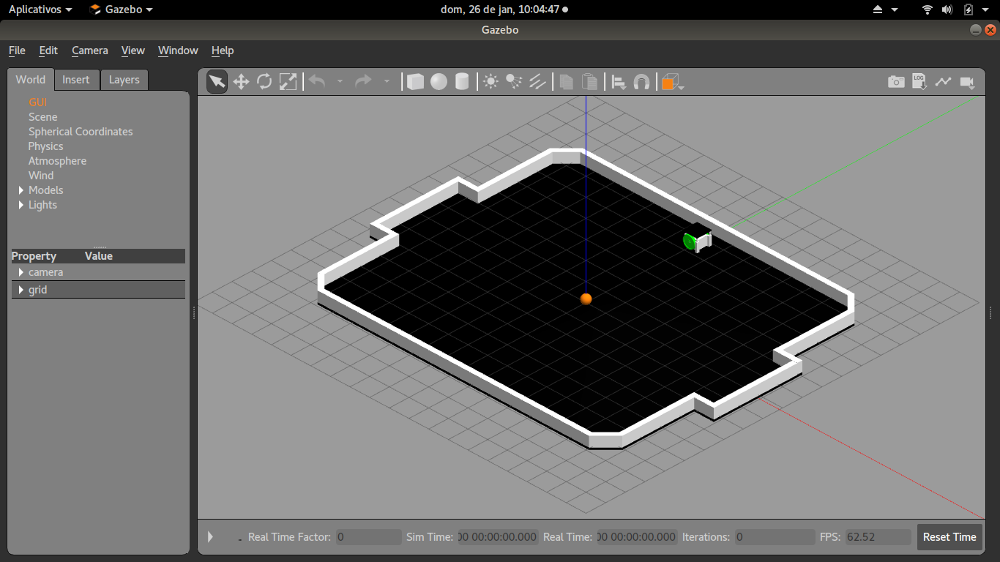
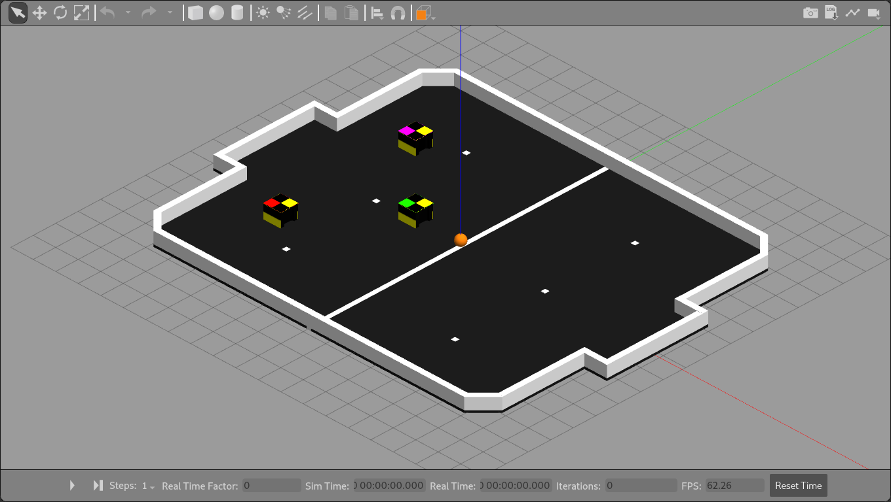
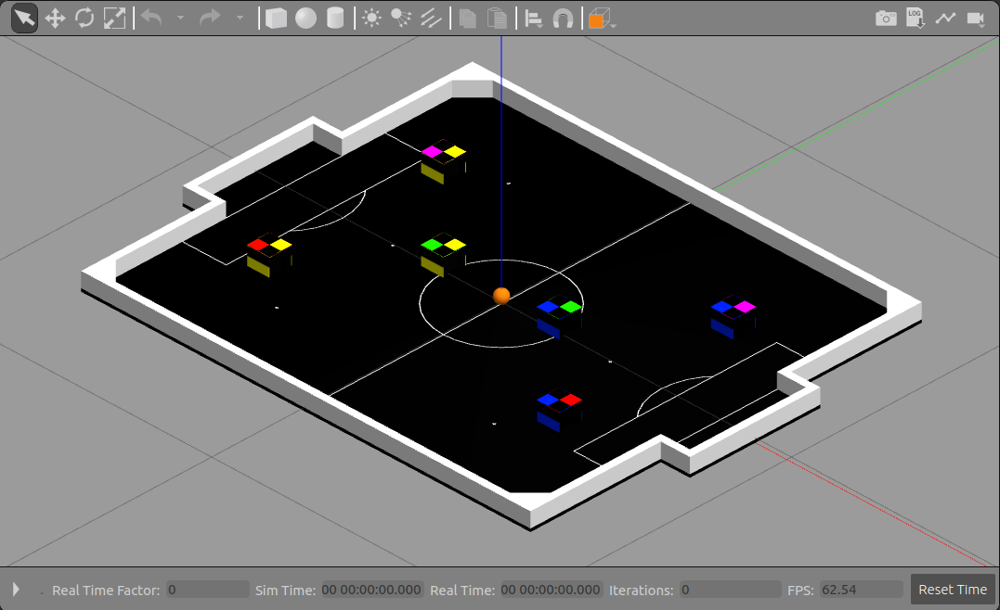
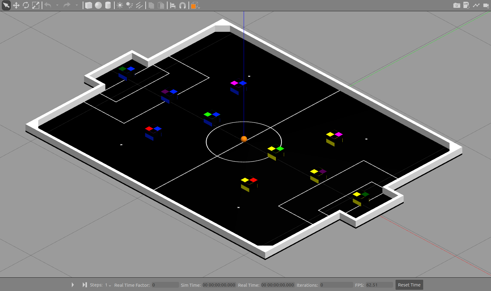

🚨 **Esse projeto foi arquivado! Confira a nova versão [aqui](https://github.com/futebol-mini/travesim)** 🚨

---

<h1 align="center">🥅 TraveSim</h1>
<p align="center">Projeto de simulação de um time IEEE VSS em um campo oficial em ROS utilizando Gazebo</p>

<p align="center">


<!-- ALL-CONTRIBUTORS-BADGE:START - Do not remove or modify this section -->

<!-- ALL-CONTRIBUTORS-BADGE:END -->
</p>

- [📷 Screenshots](#-screenshots)
- [🎈 Introdução](#-introdução)
- [🌎 Mundos](#-mundos)
- [📣 Tópicos ROS](#-tópicos-ros)
  - [⬅ Entrada](#-entrada)
    - [Controle por direção diferencial (padrão)](#controle-por-direção-diferencial-padrão)
    - [Controle direto dos motores](#controle-direto-dos-motores)
  - [➡ Saída](#-saída)
- [📏 Modelos utilizados](#-modelos-utilizados)
  - [© Crie seu próprio modelo](#-crie-seu-próprio-modelo)
- [🔧 Parâmetros](#-parâmetros)
  - [🚀 Roslaunch](#-roslaunch)
- [📷 Câmera virtual](#-câmera-virtual)
- [📁 Estrutura de pastas](#-estrutura-de-pastas)
- [➕ Dependências](#-dependências)
  - [🐍 Python virtual environment](#-python-virtual-environment)
- [🎨 Cores no Gazebo](#-cores-no-gazebo)
- [📝 Contribuindo](#-contribuindo)
- [✨ Contribuidores](#-contribuidores)

## 📷 Screenshots

<p align="center">
  
  
  
  
</p>

## 🎈 Introdução

É necessário clonar o projeto dentro de um workspace catkin. Para criar um workspace, veja [esse link](http://wiki.ros.org/catkin/Tutorials/create_a_workspace)

Para rodar a simulação com um robô controlável, digite:

```bash
roslaunch travesim simulation_robot.launch
```

Para rodar a simulação com o time completo, digite:

```bash
roslaunch travesim simulation_team.launch
```

Para rodar a simulação de uma partida, digite:

```bash
roslaunch travesim simulation_match.launch
```

## 🌎 Mundos

O TraveSim pode simular jogos com 3 ou 5 robôs por time. O número de robôs por time será inferido do mundo de simulação escolhido. Os mundos atualmente suportados são os seguintes:

- `vss_field.world` - Mundo base para partidas de 3x3
- `vss_field_camera.world` - Mundo para partidas de 3x3 com câmera e iluminação
- `vss_field_5.world` - Mundo base para partidas de 5x5

Assim, por exemplo, para executar a simulação com uma única equipe de 5 robôs, execute:

```bash
roslaunch travesim simulation_team.launch world_name:=vss_field_5.world
```

Para obter mais informações sobre os parâmetros do roslaunch, consulte a seção [🚀 Roslaunch](#-roslaunch).

## 📣 Tópicos ROS

### ⬅ Entrada

A simulação pode ser usada com duas interfaces de entrada, **controle por direção diferencial** (padrão) ou **controle direto dos motores**. É importante notar que não é possível usar as duas interfaces para controlar robôs diferentes ao mesmo tempo.

#### Controle por direção diferencial (padrão)

Por padrão, a simulação recebe comandos do tipo [geometry_msgs/Twist](http://docs.ros.org/en/melodic/api/geometry_msgs/html/msg/Twist.html), representando a velocidade do robô em duas componentes: linear e angular.

```python
# This expresses velocity in free space broken into its linear and angular parts.
Vector3  linear
Vector3  angular
```

Os tópicos ROS seguem a convenção de nomenclatura:

- **/yellow_team/robot_[0..2|0..4]/diff_drive_controller/cmd_vel**
- **/blue_team/robot_[0..2|0..4]/diff_drive_controller/cmd_vel**

O controle do robô é feito pelo [diff_driver_controller](http://wiki.ros.org/diff_drive_controller). Os parâmetros de controle estão especificados no arquivo [./config/motor_diff_drive.yml](./config/motor_diff_drive.yml). O controlador representa o comportamento do sistema de controle embarcado no robô e envia comandos de torque para os motores de modo a seguir o set point recebido.

Os parâmetros do controlador estão especificados no arquivo [./config/motor_diff_drive.yml](./config/motor_diff_drive.yml).

#### Controle direto dos motores

A simulação também aceita controle diretamente por meio de comandos de **velocidade angular** para ambos os motores do robô (por meio da interface [velocity_controller](http://wiki.ros.org/velocity_controllers) do pacote [ros_control](http://wiki.ros.org/ros_control)). Essa interface imita uma interface de controle mais acoplada às características do robô em relação ao controle de direção diferencial.

Os comandos são lidos de tópicos do tipo [std_msgs/Float64](http://docs.ros.org/noetic/api/std_msgs/html/msg/Float64.html), representando a velocidade de cada motor em **rad/s**

- **/yellow_team/robot_[0..2|0..4]/left_controller/command**
- **/yellow_team/robot_[0..2|0..4]/right_controller/command**
- **/blue_team/robot_[0..2|0..4]/left_controller/command**
- **/blue_team/robot_[0..2|0..4]/right_controller/command**

Para habilitar essa interface de controle, é necessário enviar o parâmetro `twist_interface` como false nos [parâmetros](#-parâmetros) do roslaunch

### ➡ Saída

Por padrão, o Gazebo publica no tópico **/gazebo/model_states** do tipo [gazebo_msgs/ModelStates](http://docs.ros.org/melodic/api/gazebo_msgs/html/msg/ModelStates.html), com uma lista de informações acerca de cada um dos modelos presentes na simulação.

```python
# broadcast all model states in world frame
string[] name                 # model names
geometry_msgs/Pose[] pose     # desired pose in world frame
geometry_msgs/Twist[] twist   # desired twist in world frame
```

Por comodidade, este pacote possui um script ([vision_proxy.py](./scripts/vision_proxy.py)) que se inscreve nesse tópico e republica a informação diferentes tópicos do tipo [gazebo_msgs/ModelState](http://docs.ros.org/melodic/api/gazebo_msgs/html/msg/ModelState.html) para cada entidade (3 robôs do time amarelo, 3 robôs do time azul e 1 bola, 7 tópicos no total)

```python
# Set Gazebo Model pose and twist
string model_name           # model to set state (pose and twist)
geometry_msgs/Pose pose     # desired pose in reference frame
geometry_msgs/Twist twist   # desired twist in reference frame
string reference_frame      # set pose/twist relative to the frame of this entity (Body/Model)
                            # leave empty or "world" or "map" defaults to world-frame
```

Os tópicos republicados são

- **/vision/yellow_team/robot_[0..2|0..4]** - Tópicos para os robôs do time amarelo
- **/vision/blue_team/robot_[0..2|0..4]** - Tópicos para os robôs do time azul
- **/vision/ball** - Tópico para a bola

Todas as unidades estão no SI, distâncias estão em metros, ângulos estão em radianos, velocidade linear está em m/s e velocidade angular está em rad/s

## 📏 Modelos utilizados

A simulação é construída a partir de um modelo de robô de VSS genérico, inspirado no modelo do [VSS SDK model](https://github.com/VSS-SDK/VSS-SDK)

Como suporte, foram criados modelos para o campo do VSS e para a bola de golf utilizada na partida, ambos construídos a partir das [regras da Robocore](https://www.robocore.net/modules.php?name=Forums&file=download&id=1424) para IEEE VSS.

### © Crie seu próprio modelo

Para criar um modelo urdf do seu projeto, você pode utilizar as ferramentas

- [Phobos](https://github.com/dfki-ric/phobos) - Gera arquivos urdf files a partir do Blender
- [SW2URDF](http://wiki.ros.org/sw_urdf_exporter) - Gera arquivos urdf a partir do SolidWorks
- [fusion2urdf](https://github.com/syuntoku14/fusion2urdf) - Gera arquivos urdf a partir do Fusion 360
- [ROS wiki](http://wiki.ros.org/urdf/Tutorials/Building%20a%20Visual%20Robot%20Model%20with%20URDF%20from%20Scratch) - Como criar um modelo urdf do zero

Para usar seu modelo customizado, altere o valor do parâmetro ```model``` ao iniciar a simulação

## 🔧 Parâmetros

### 🚀 Roslaunch

- ```world_name``` - Nome o arquivo de mundo utilizado, padrão "vss_field.world"
- ```model``` - Caminho do modelo do robô simulado, padrão "./urdf/vss_robot.xacro"
- ```controller_config_file``` - Caminho do arquivo de configuração dos controladores do robô simulado, padrão "./config/motor_diff_drive.yml" se `twist_interface` é "true", "./config/motor_direct_drive.yml" caso contrário
- ```ros_control_config_file``` - Caminho do arquivo de configuração do `gazebo_ros_control`, padrão "./config/ros_control_config.yml"
- ```debug``` - Habilita mensagens de debug no terminal, padrão "false"
- ```gui``` - Habilita janela GUI do Gazebo, padrão "true"
- ```paused``` - Inicia a simulação com pause, padrão "true"
- ```use_sim_time``` - Utiliza o tempo da simulação como referências das msgs, padrão "true"
- ```recording``` - Habilita o log de estados do Gazebo, padrão "false"
- ```keyboard``` - Habilita o node do controle pelo teclado/joystick, padrão "false"
- ```twist_interface``` - Habilita a interface controle por meio de mensagens [geometry_msgs/Twist](http://docs.ros.org/en/melodic/api/geometry_msgs/html/msg/Twist.html) se verdadeiro, utiliza a interface de controle com 2 mensagens std_msgs/Float64 caso contrário. Padrão "true". Veja a [documentação](#-entrada) para mais detalhes.

Para passar um parâmetro na execução da simulação, basta escrever o nome do parâmetro separado do novo valor com ```:=```

Por exemplo, para mudar o parâmetro ```keyboard``` para ```true```:

```bash
roslaunch travesim simulation_team.launch keyboard:=true
```

## 📷 Câmera virtual

A simulação possui uma câmera virtual que captura imagens do topo do campo, de forma semelhante ao que acontece em uma partida de VSS real. Para habilita-la, é necessário utilizar o arquivo de mundo `vss_field_camera.world`

```sh
roslaunch travesim simulation_team.launch world_name:=vss_field_camera.world
```

A câmera publica as imagens obtidas no tópico **/camera/image_raw**

É possível acompanhar as imagens com o auxílio do pacote [image_view](http://wiki.ros.org/image_view)

```sh
rosrun image_view image_view image:=/camera/image_raw
```

## 📁 Estrutura de pastas

- **bagfiles/** - Pasta para guardar [bagfiles](./bagfiles/README.md)
- **docs/** - Arquivos de documentação
- **launch/** - Arquivos do [roslaunch](http://wiki.ros.org/roslaunch) escritos na [sintaxe XML](http://wiki.ros.org/roslaunch/XML) do ROS
- **meshes/** - Arquivos .stl do modelo dos nossos robôs, gerados com a extensão [SW2URDF](http://wiki.ros.org/sw_urdf_exporter) do SolidWorks
- **models/** - [Modelos personalizados para Gazebo](http://gazebosim.org/tutorials?tut=build_model) utilizados na simulação, como o campo e a bola do VSS
- **scripts/** - Rotinas python usadas no projeto
  - keyboard_node.py - Rotina para capturar a entrada do teclado ou de um joystick para controlar a simulação.
  - vision_proxy.py - Rotina para separar a informação de estado do Gazebo em tópicos diferentes para cada modelo (robôs e bola).
- **urdf/** - Arquivos de descrição dos robôs no formato [.urdf](http://wiki.ros.org/urdf/XML) e [.xacro](http://wiki.ros.org/xacro). Os arquivos .urdf gerados com a extensão [SW2URDF](http://wiki.ros.org/sw_urdf_exporter) do SolidWorks
- **worlds/** - Arquivos .world no formato [SDL](http://sdformat.org/)

## ➕ Dependências

A simulação é desenvolvida para ROS e Gazebo, é recomendável instalar ambos com o comando:

```bash
sudo apt install ros-noetic-desktop-full
```

O projeto depende do pacote velocity_controllers e do effort_controllers dentro da biblioteca [ros_controllers](https://github.com/ros-controls/ros_controllers) e da biblioteca python [pygame](https://github.com/pygame/pygame). É possível instalar com ```apt-get```

```bash
sudo apt install ros-noetic-velocity-controllers ros-noetic-effort-controllers python3-pygame
```

Ou usando ```rosdep```

```bash
rosdep install travesim
```

### 🐍 Python virtual environment

Você pode querer rodar o projeto dentro de um ambiente virtual de python ([python virtualenv](https://docs.python.org/3/tutorial/venv.html)), afinal, essa é uma boa prática listada no livro de bolso de desenvolvimento python

Você pode criar um novo ambiente virtual com o comando

```sh
python3 -m venv venv
```

Em seguida, você deve rodar ```source``` para ativar o ambiente virtual

```sh
source ./venv/bin/activate
```

Para instalar as dependências, rode o comando

```sh
pip install -r requirements.txt
```

Algumas bibliotecas externas podem estar faltando para [compilar](https://stackoverflow.com/questions/7652385/where-can-i-find-and-install-the-dependencies-for-pygame) o pacote ```pygame```. Você pode instalar tudo com o comando

```sh
sudo apt-get install
  subversion \
  ffmpeg \
  libsdl1.2-dev \
  libsdl-image1.2-dev \
  libsdl-mixer1.2-dev \
  libsdl-ttf2.0-dev \
  libavcodec-dev \
  libavformat-dev \
  libportmidi-dev \
  libsmpeg-dev \
  libswscale-dev \
```

## 🎨 Cores no Gazebo

Para uma lista das cores disponíveis no Gazebo, confira o arquivo de configuração do [repo oficial](hhttps://github.com/osrf/gazebo/blob/gazebo11/media/materials/scripts/gazebo.material). Temos também 2 scripts OGRE [team blue](./media/materials/scripts/team_blue.material.material) e [team yellow](./media/materials/scripts/team_yellow.material.material) para a definição de cores customizadas ([ref Gazebo](http://gazebosim.org/tutorials?tut=color_model) e [ref OGRE](http://wiki.ogre3d.org/Materials)).

## 📝 Contribuindo

Toda a ajuda no desenvolvimento da robótica é bem-vinda, nós lhe encorajamos a contribuir para o projeto! Para saber como fazer, veja as diretrizes de contribuição [aqui](CONTRIBUTING.pt-br.md).

## ✨ Contribuidores

Agradecimentos a essas pessoas incríveis ([emoji key](https://allcontributors.org/docs/en/emoji-key)):

<!-- ALL-CONTRIBUTORS-LIST:START - Do not remove or modify this section -->
<!-- prettier-ignore-start -->
<!-- markdownlint-disable -->
<table>
  <tr>
    <td align="center"><a href="https://github.com/FelipeGdM"><br /><sub><b>Felipe Gomes de Melo</b></sub></a><br /><a href="https://github.com/thunderatz/travesim/commits?author=FelipeGdM" title="Documentation">📖</a> <a href="https://github.com/thunderatz/travesim/pulls?q=is%3Apr+reviewed-by%3AFelipeGdM" title="Reviewed Pull Requests">👀</a> <a href="https://github.com/thunderatz/travesim/commits?author=FelipeGdM" title="Code">💻</a> <a href="#translation-FelipeGdM" title="Translation">🌍</a></td>
    <td align="center"><a href="https://github.com/LucasHaug"><br /><sub><b>Lucas Haug</b></sub></a><br /><a href="https://github.com/thunderatz/travesim/pulls?q=is%3Apr+reviewed-by%3ALucasHaug" title="Reviewed Pull Requests">👀</a> <a href="https://github.com/thunderatz/travesim/commits?author=LucasHaug" title="Code">💻</a> <a href="#translation-LucasHaug" title="Translation">🌍</a> <a href="https://github.com/thunderatz/travesim/commits?author=LucasHaug" title="Documentation">📖</a></td>
    <td align="center"><a href="https://github.com/Tocoquinho"><br /><sub><b>tocoquinho</b></sub></a><br /><a href="#ideas-Tocoquinho" title="Ideas, Planning, & Feedback">🤔</a> <a href="https://github.com/thunderatz/travesim/commits?author=Tocoquinho" title="Documentation">📖</a></td>
    <td align="center"><a href="https://github.com/Berbardo"><br /><sub><b>Bernardo Coutinho</b></sub></a><br /><a href="https://github.com/thunderatz/travesim/pulls?q=is%3Apr+reviewed-by%3ABerbardo" title="Reviewed Pull Requests">👀</a> <a href="https://github.com/thunderatz/travesim/commits?author=Berbardo" title="Code">💻</a> <a href="https://github.com/thunderatz/travesim/commits?author=Berbardo" title="Documentation">📖</a></td>
    <td align="center"><a href="https://github.com/lucastrschneider"><br /><sub><b>Lucas Schneider</b></sub></a><br /><a href="https://github.com/thunderatz/travesim/pulls?q=is%3Apr+reviewed-by%3Alucastrschneider" title="Reviewed Pull Requests">👀</a> <a href="https://github.com/thunderatz/travesim/commits?author=lucastrschneider" title="Code">💻</a> <a href="#translation-lucastrschneider" title="Translation">🌍</a> <a href="https://github.com/thunderatz/travesim/commits?author=lucastrschneider" title="Documentation">📖</a></td>
    <td align="center"><a href="https://github.com/JuliaMdA"><br /><sub><b>Júlia Mello</b></sub></a><br /><a href="#design-JuliaMdA" title="Design">🎨</a> <a href="#data-JuliaMdA" title="Data">🔣</a></td>
    <td align="center"><a href="https://github.com/ThallesCarneiro"><br /><sub><b>ThallesCarneiro</b></sub></a><br /><a href="#design-ThallesCarneiro" title="Design">🎨</a> <a href="#data-ThallesCarneiro" title="Data">🔣</a></td>
  </tr>
  <tr>
    <td align="center"><a href="https://github.com/TetsuoTakahashi"><br /><sub><b>TetsuoTakahashi</b></sub></a><br /><a href="#ideas-TetsuoTakahashi" title="Ideas, Planning, & Feedback">🤔</a></td>
    <td align="center"><a href="https://github.com/GabrielCosme"><br /><sub><b>Gabriel Cosme Barbosa</b></sub></a><br /><a href="https://github.com/thunderatz/travesim/pulls?q=is%3Apr+reviewed-by%3AGabrielCosme" title="Reviewed Pull Requests">👀</a></td>
    <td align="center"><a href="https://github.com/RicardoHonda"><br /><sub><b>RicardoHonda</b></sub></a><br /><a href="https://github.com/thunderatz/travesim/pulls?q=is%3Apr+reviewed-by%3ARicardoHonda" title="Reviewed Pull Requests">👀</a></td>
    <td align="center"><a href="https://github.com/leticiakimoto"><br /><sub><b>leticiakimoto</b></sub></a><br /><a href="https://github.com/thunderatz/travesim/pulls?q=is%3Apr+reviewed-by%3Aleticiakimoto" title="Reviewed Pull Requests">👀</a></td>
  </tr>
</table>

<!-- markdownlint-restore -->
<!-- prettier-ignore-end -->

<!-- ALL-CONTRIBUTORS-LIST:END -->

Esse projeto segue a especificação do [all-contributors](https://github.com/all-contributors/all-contributors). Contribuições de qualquer tipo são bem vindas!
