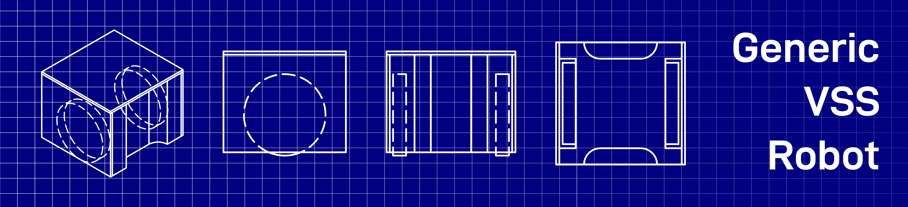

# 📏 Generic VSS Robot

## 📂 Overview

Inside this folder are the description files for a Generic VSS Robot

- **generic\_vss\_robot.urdf** - [URDF](http://wiki.ros.org/urdf) description of the robot, generated with [SW2URDF](http://wiki.ros.org/sw_urdf_exporter) extension for SolidWorks
- **generic\_vss\_robot.xacro** - Main file that imports all other files
- **generic\_vss\_robot.gazebo** - Gazebo-specific configurations i.e. physical properties and colors configuration
  - **generic\_vss\_team.gazebo** - Different color configurations for both teams (Yellow/Blue) and each robot (1..3) inside the team.
- **motor.xacro** - Configuration of actuator and transmission element for motor control with [hardware\_interface](http://wiki.ros.org/ros_control#Hardware_Interfaces) lib from [ros\_control](http://wiki.ros.org/ros_control)
- **generic_vss_robot.pdf** - Detailed blueprint from the 3D model

Inside the **meshes/** folder, are the .stl files for each part of the robot and inside **media/materials/scripts/** are [OGRE scripts](http://wiki.ogre3d.org/Materials) to define different colors and textures.

## 📜 Main parameters

|     Parameter     |           Value| Unit  |
|:-----------------:|---------------:|:------|
|    Wheel radius   |              25| mm    |
|  Wheel thickness  |               8| mm    |
| Wheels separation |              55| mm    |
|       Height      |              62| mm    |
|       Width       |              78| mm    |
|       Length      |              78| mm    |
|   Wheels density  |            1150| kg/m³ |
|  Wheels material  |           Nylon| \-    |
|   Body material   |  50% infill ABS| \-    |
|    Body density   |             510| kg/m³ |
|     Total mass    |           \~180| g     |
